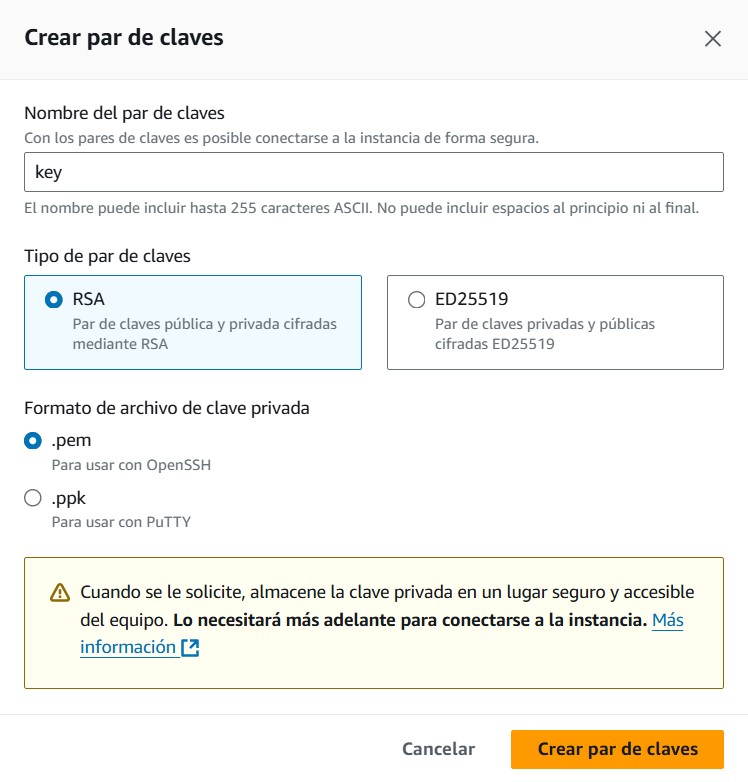

# Guía para Desplegar en AWS EC2

En esta guía, aprenderás cómo configurar una instancia EC2 en AWS y prepararla para ejecutar la aplicación dentro de un contenedor Docker.

## Pasos para Configurar una Instancia EC2

### 1. Accede al Servicio EC2
- Ve a la consola de **AWS** y busca el servicio **EC2**.
- Haz clic en el botón **"Lanzar instancia"**.

### 2. Nombra tu Instancia
- Asigna un nombre descriptivo a tu instancia. Esto te ayudará a identificarla fácilmente más adelante.

### 3. Selecciona un Sistema Operativo
- Elige una **AMI (Amazon Machine Image)** con una distribución de Linux. Por ejemplo, puedes seleccionar **Amazon Linux 2** o **Ubuntu**.

### 4. Selecciona el Tipo de Instancia
- Usa un tipo de instancia con recursos básicos como **t2.micro**. Esta opción es suficiente para pruebas y está incluida en el nivel gratuito de AWS.

### 5. Configura la Red y las Reglas de Seguridad
- Configura la red según tus necesidades. En este caso, puedes dejar las opciones por defecto.
- Asegúrate de permitir tráfico SSH seleccionando **"Permitir tráfico SSH"** y configurando el rango de IPs según prefieras (puedes usar "Cualquier dirección IP" para simplificar).

### 6. Crea un Par de Claves
- Crea un nuevo par de claves para conectar a tu instancia de forma segura.
  - Descarga el archivo `.pem` (para SSH desde Linux/Mac) o `.ppk` (para Windows con PuTTY).
  - Guarda este archivo en un lugar seguro, ya que lo necesitarás para conectarte a la instancia.

### 7. Lanza la Instancia
- Revisa tu configuración y haz clic en **"Lanzar instancia"** para completarlo.

### 8. Agregar regla de entrada
- Para lanzar la app deberas tener la regla de entrada en el puerto 80 para http
  
