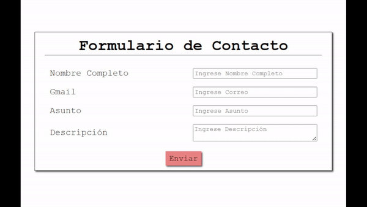

# Formulario No Controlado con React y TypeScript

## Descripción
Este proyecto consiste en un formulario no controlado desarrollado con **React** y **TypeScript**. El objetivo principal es proporcionar una aplicación simple que se pueda ejecutar en un contenedor **Docker**, lo que permite probar su funcionamiento de manera consistente en cualquier entorno. Además, este proyecto incluye una guía detallada sobre cómo desplegar la aplicación en una instancia EC2 de **AWS** para facilitar las pruebas en la nube con Docker.
## Tecnologías
  - React - TypeScript - Docker - AWS (EC2)
  - Html - css - sass - Js
### Requisitos
1. Tener instalado Git
2. Tener instalado Docker
### Pasos
1. **Clonar el repositorio:**
   Para comenzar, clona este repositorio en tu máquina local o servidor.
   Tambien puedes ejecutar en una instancia **ec2** Con la siguiente Guia [AWS-Guia.md](./AWS-Guia.md) Recuerda tener Git y Docker.

   ```bash
   git clone https://github.com/fernando-caris/form-no-controller.git

2. **Construir la imagen Docker:**
   Una vez clonado el repositorio, navega al directorio del proyecto y construye la imagen Docker:

   ```bash
   cd form-no-controller
   docker build -t formulario-react .
   ```

3. **Ejecutar el contenedor Docker:**
   Ejecuta la aplicación en un contenedor Docker mapeando el puerto 3000 al puerto 80 de tu máquina:
   ```bash
   docker run -p 80:3000 formulario-react
   ```
   
   
   
